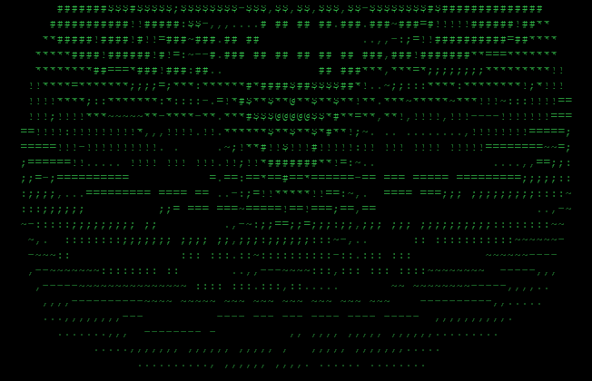

<div align="center">

```text
 ____      _    _   _    _    ____  _____ _____ ____  
|  _ \    / \  | \ | |  / \  |  _ \| ____| ____|  _ \ 
| |_) |  / _ \ |  \| | / _ \ | | | |  _| |  _| | |_) |
|  _ <  / ___ \| |\  |/ ___ \| |_| | |___| |___|  __/ 
|_| \_\/_/   \_\_| \_/_/   \_\____/|_____|_____|_|    
                                                      
__     _____ _   _ _   _ _  _____  _   _ ____    _    
\ \   / /_ _| \ | | | | | |/ / _ \| \ | |  _ \  / \   
 \ \ / / | ||  \| | | | | ' / | | |  \| | | | |/ _ \  
  \ V /  | || |\  | |_| | . \ |_| | |\  | |_| / ___ \ 
   \_/  |___|_| \_|\___/|_|\_\___/|_| \_|____/_/   \_\
```

[](https://git.io/typing-svg)

[github.com/RanadeepVinukonda](https://github.com/RanadeepVinukonda)

</div>

---

## About

<table>
  <tr>
    <td align="center">
      
    </td>
    <td valign="middle">
      <pre><b>Ranadeep Vinukonda</b>

Degree : B.Tech CSE @ UCEK, Kakinada
Focus  : Full Stack ┬╖ Systems ┬╖ ML/DL
Stack  : React ┬╖ Node ┬╖ TypeScript ┬╖ Go ┬╖ Python
Cloud  : GCP ┬╖ Azure
Base   : Ongole, Andhra Pradesh, India
Status : Open to opportunities</pre>
    </td>
  </tr>
</table>

**Current** → CTO @ EduAltTech — an e-learning full-stack platform

**Learning** → Go · TypeScript · System Design · Cloud SRE

**Studying** → Machine Learning & Deep Learning

**Exploring** → GCP, GenAI applications, model deployment & MLOps

**Expertise** → React, Node.js, TypeScript, Go, Python, ML models

**Contact** → viranadeep@gmail.com

Computer Science undergraduate at **UCEK Kakinada** building products at the intersection of full-stack development and data science. As the **CTO** of EduAltTech, I design and lead the engineering behind an e-learning platform built to make skill-sharing accessible and collaborative. Clean architecture, pragmatic ML, and shipping software that real people use. Currently deep-diving into **Go, TypeScript, system design, Cloud SRE, and ML/DL**.

---

## The Startup

**CTO @ [Edu Alt Tech](https://github.com/RanadeepVinukonda/EduAlTech)**

*Edu Alt Tech ΓÇö E-learning platform*

### Making skill-sharing accessible, collaborative, and community-driven.

> Designing and implementing cutting-edge technology solutions that power our platform, ensuring security, scalability, and innovative student experiences.

- **Problem** ΓÇö Traditional education is one-size-fits-all; students deserve learning that adapts to them.
- **Solution** ΓÇö EduAltTech, a platform where students learn and share skills together.
- **Role** ΓÇö Lead architecture, product vision, and the engineering team end-to-end.

---

## Skills

*Building with ┬╖ Studying more*

**Full Stack Development**

<p align="center">
&nbsp;
&nbsp;
&nbsp;
&nbsp;
&nbsp;
&nbsp;
&nbsp;
&nbsp;
&nbsp;
&nbsp;
&nbsp;

</p>

**System Backend**

<p align="center">
&nbsp;
&nbsp;
&nbsp;
&nbsp;
&nbsp;
&nbsp;
&nbsp;
&nbsp;
&nbsp;

</p>

**Cloud SRE**

<p align="center">
&nbsp;
&nbsp;
&nbsp;
&nbsp;
&nbsp;
&nbsp;
&nbsp;

</p>

**AI, ML & Deep Learning**

<p align="center">
&nbsp;
&nbsp;
&nbsp;
&nbsp;
&nbsp;
&nbsp;
&nbsp;
&nbsp;
&nbsp;
&nbsp;
&nbsp;
&nbsp;
&nbsp;
&nbsp;

</p>

---

## Projects

*Selected work*

| Project | Description |
|---------|-------------|
| [**EduAlTech**](https://github.com/RanadeepVinukonda/EduAlTech) | E-learning platform to learn & share skills |
| [**Customer Spending Forecast**](https://github.com/RanadeepVinukonda/Customer-Spending-Forecast) | Predicts customer spending with regression |
| [**Auto ML Regression Trainer**](https://github.com/RanadeepVinukonda/-Auto-ML-Linear-Regression-Trainer) | Upload dataset → auto-train + live predictions |
| [**LLM Book Recommender**](https://github.com/RanadeepVinukonda/LLm-Book-Recommender) | AI-powered book recommendations |
| [**Plot Generator**](https://github.com/RanadeepVinukonda/Plot-Generator) | Auto-generates visual plots from datasets |

---

## Certifications

*Continuous learning*

- **Meta** ΓÇö Intro to Backend Development
- **IBM** ΓÇö Introduction to Artificial Intelligence
- **University of London** ΓÇö Machine Learning for All
- **Google Cloud** ΓÇö Build Real-World AI Apps with Gemini & Imagen
- **Google Cloud Gen AI Exchange** ΓÇö Gen AI Academy (5 courses, powered by Hack2skill)
- **Microsoft Azure AI** — Internship by Edunet Foundation × AICTE
- **Infosys Springboard** ΓÇö Virtual Internship 6.0 (Audio Book Generator project)

---

## GitHub Stats

<p align="center">
  
  
</p>
<p align="center">
  
</p>

---

## Connect

*Let's talk*

<p align="center">
<a href="https://github.com/RanadeepVinukonda"></a>&nbsp;&nbsp;
<a href="https://linkedin.com/in/ranadeepvinukonda"></a>&nbsp;&nbsp;
<a href="https://instagram.com/vinukondaranadeep"></a>&nbsp;&nbsp;
<a href="https://medium.com/@viranadeep"></a>&nbsp;&nbsp;
<a href="mailto:viranadeep@gmail.com"></a>
</p>

---

<div align="center">

**© 2026 Ranadeep Vinukonda**

[github](https://github.com/RanadeepVinukonda) ┬╖ [linkedin](https://linkedin.com/in/ranadeepvinukonda)

</div>
